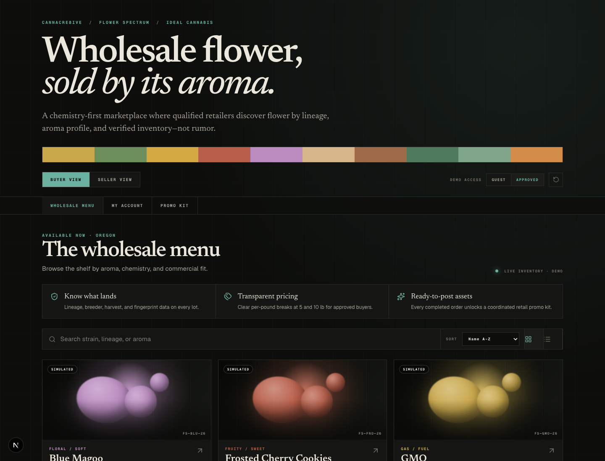
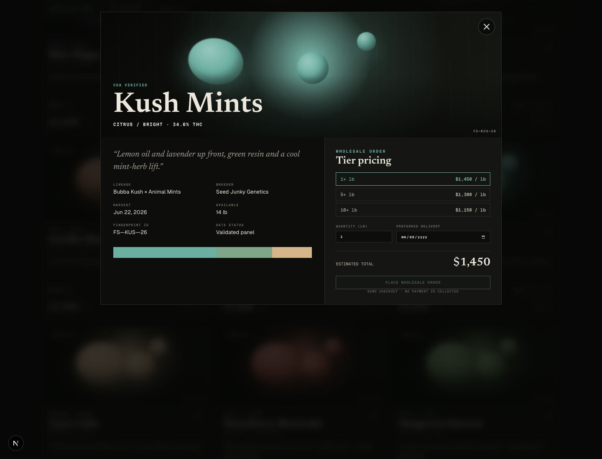

# Flower Spectrum Wholesale Portal

[](https://fs-wholesale-order-portal.vercel.app)

Production-structured Next.js application for an Ideal Cannabis B2B wholesale workflow. The experience supports buyer and seller perspectives, tiered wholesale pricing, access gating, fulfillment state, live demo inventory, account history, and purchase-unlocked promo assets.

## Latest deployment

**[Open the latest Vercel deployment](https://fs-wholesale-order-portal.vercel.app)**

The stable deployment link above is kept in this README so the GitHub repository always points to the current Vercel build. Unique deployment URLs are also recorded in GitHub deployments.

## Screenshots





## Local development

```bash
npm install
npm run dev
```

Open [http://localhost:3000](http://localhost:3000).

## Quality checks

```bash
npm run check
```

This runs linting, TypeScript, unit tests, and a production build.

## Architecture

- `src/app` — App Router entry point, metadata, and global design system
- `src/components` — focused UI and workflow components
- `src/context` — shared, browser-persisted demo state
- `src/lib` — domain types, fixtures, pricing behavior, and tests
- `docs/source` — archived original single-file prototype
- `docs/screenshots` — current deployment captures

See [PROJECT_CONTEXT.md](PROJECT_CONTEXT.md) for personas, boundaries, production integration seams, and product safeguards.

## Deployment

The repository is connected to Vercel. Every Git push creates a deployment; the `main` branch updates the stable URL linked above.

## Important demo limitations

The product and account data are illustrative. Only the Kush Mints chemistry panel is labeled COA-verified; other classifications remain visibly marked as simulated. This app does not make medical or effects claims and does not collect payment.
